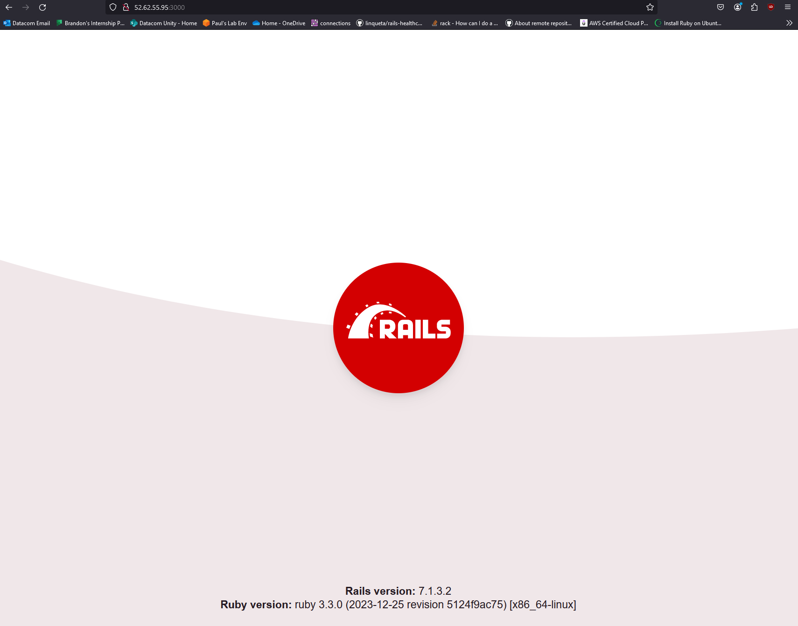

# IaC Cloud Web Server
### Creating a Ruby on Rails web server in the cloud with AWS and Terraform.

## Task
For this project I was tasked with creating a web server on the cloud. The server will be using Ruby on Rails to display a "Hello World!" message in a header. The cloud architecture for this project needed to roughly comply with this diagram (The services on the left of the architecture were optional services we could include):

<strong>Note:</strong> The primary and secondary databases in this project are redundant. They are there just to show my technical ability in setting up the servers. The secondary database is a read-only replica.

## Design

I altered the architecture to avoid using some of the AWS services that incur costs because I originally tried using free-tier services. However, I was able to use a sandbox environment that paid for the costs of services, so some of my services do incur a cost.

#### First Iteration:

#### Second Iteration:

The design changes I made to this iteration was to put the EC2 instances into private subnets instead of public, as this would be better security practice.

#### Third Iteration:

In this iteration I've included an extra route table for each instance in each private subnet to route them to the NAT Gateways in public subnet 1 and 2, as it is not a multi-az service.

I've also removed ports 443 and 80 as inbound and outbound in security group 1 and inbound in security group 2.

#### Fourth Iteration:

<!-- (add image of fourth iteration) -->

The inbound ports that should be kept open are 443, 80, 3000 in SG 1. These ports in theory should be all that is required to start the server. However to test if the application runs, I would place the EC2 instance in a public subnet in SG 1 and have found that with those ports open for inbound and outbound traffic, the application is still unable to run. However, it does work when all inbound and outbound ports run. The error I am given is: 

`Cannot initiate the connection to ap-southeast-2.ec2.archive.ubuntu.com:80` 

I assume that the error is due to an Ubuntu port being blocked, and my ephemeral ports need to be opened between ports 32768 and 61000.

### Subnetting

My master CIDR block for this architecture was <strong>192.168.0.0/16</strong> I was able to subnet this across 3 tiers.

- The load balancers/NAT Gateway tier - <strong>192.168.0.0/18</strong>
- Application tier - <strong>192.168.64.0/18</strong>
- Database tier - <strong>192.168.128.0/18</strong>

The CIDR blocks for the architecture are as follows: 

#### Public Subnets

NAT Gateway and application load balancer belong in these subnets

Public Subnet 1 = <strong>192.168.0.0/19</strong>  
Public Subnet 2 = <strong>192.168.32.0/19</strong>

#### Private Subnets

EC2 instances/Auto-scaling group belong in private subnet 1 & 2
 
Amazon RDS databases belong in private subnet 3 & 4

Private Subnet 1 = <strong>192.168.64.0/19</strong>  
Private Subnet 2 = <strong>192.168.96.0/19</strong>  
Private Subnet 3 = <strong>192.168.128.0/19</strong>  
Private Subnet 4 = <strong>192.168.160.0/19</strong>  

#### Security Groups

Security Group 1 (NAT Gateway & ALB) = <strong>192.168.0.0/18</strong>  
Security Group 2 (EC2 Instances) = <strong>192.168.64.0/18</strong>  
Security Group 3 (Databases) = <strong>192.168.128.0/18</strong> 

## Objectives

- Deploy the web server with a user data script on the instances.
- Create an autoscaling group that can add/remove an EC2 instance depending on the load on the CPU.
- Create a read-only Amazon RDS database that uses MySQL.
- Create an application load balancer that can switch between instances depending on the health status of the instances as well as work with the auto-scaling group.
- Create EC2 instances that can switch to the secondary database given that the primary is unhealthy.

## What I Have Achieved

I can successfully launch my test instance which is placed in a public subnet and access the web page.

Image for reference: 

The webpage on launch will display "Hello World!", however I cannot launch the project without exceeding the budget of the sandbox environment.

## Challenges:

- Logging access and connection logs into S3 bucket
- 502 Bad gateway (Unhealthy instance issue)
- User data scripts
    - Couldn’t clone repository
    - Incorrect dependencies
    - Incorrect versioning
    - Went back and forth, trying it on Amazon Linux 2 and Ubuntu-22.04.
- Security group port, I think for Ubuntu or ephemeral ports being blocked.	

I had an issue where my application load balancer was not logging my access and connection logs due to a permission issue with the bucket that was resolved following this link:
[Enable Logging](https://docs.aws.amazon.com/elasticloadbalancing/latest/application/enable-access-logging.html)

## Limitations

The monthly costs of the sandbox environment.