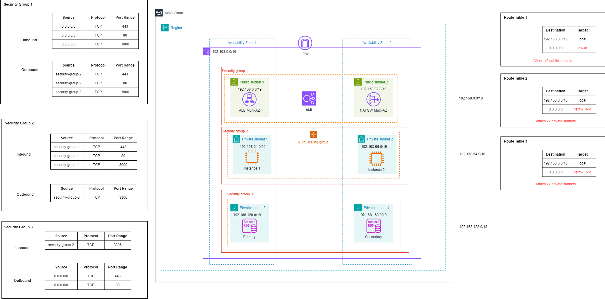

# IaC Cloud Web Server

### Creating a Ruby on Rails web server in the cloud with AWS and Terraform.

## Task

For this project I was tasked with creating a web server on the cloud. The server will be using Ruby on Rails to display a "Hello World!" message in a header. The cloud architecture for this project needed to roughly comply with this diagram (The services on the left of the architecture were optional services we could include):

This is the [Ruby On Rails Project](https://github.com/rajrtd/ror-project) that will be launched in the cloud architecture.

<strong>Note:</strong> The primary and secondary databases in this project are redundant. They are there just to show my technical ability in setting up the servers. The secondary database is a read-only replica.

## Design

I altered the architecture to avoid using some of the AWS services that incur costs because I originally tried using free-tier services. However, I was able to use a sandbox environment that paid for the costs of services, so some of my services do incur a cost.

#### First Iteration:

#### Second Iteration:

The design changes I made to this iteration was to put the EC2 instances into private subnets instead of public, as this would be better security practice.

#### Third Iteration:

In this iteration I've included an extra route table for each instance in each private subnet to route them to the NAT Gateways in public subnet 1 and 2, as it is not a multi-az service.

I've also removed ports 443 and 80 as inbound and outbound in security group 1 and inbound in security group 2.

#### Fourth Iteration:

The inbound and outbound ports that should be kept open are 443, 80, and 3000 in security group 1. These ports in theory should be all that is required to start the server within private subnet 1. However, I was unable to start the server when placing the instance in public subnet 1, within security group 1. I found that when all ports were open for inbound and outbound traffic, the server was able to start up.

The error message I was getting in my cloud-init-output.log file was:

`Cannot initiate the connection to ap-southeast-2.ec2.archive.ubuntu.com:80`

Since port 80 traffic was open for inbound and outbound traffic and I had also tested the outbound traffic being open to the internet ("0.0.0.0/0) and it still did not work. I assume that the error is due to an Ubuntu port being blocked, and my ephemeral ports need to be opened between ports 32768 and 61000.

### Subnetting

My master CIDR block for this architecture was <strong>192.168.0.0/16</strong> I was able to subnet this across 3 tiers.

- The load balancers/NAT Gateway tier - <strong>192.168.0.0/18</strong>
- Application tier - <strong>192.168.64.0/18</strong>
- Database tier - <strong>192.168.128.0/18</strong>

The CIDR blocks for the architecture are as follows:

#### Public Subnets

NAT Gateway and application load balancer belong in these subnets

Public Subnet 1 = <strong>192.168.0.0/19</strong>  
Public Subnet 2 = <strong>192.168.32.0/19</strong>

#### Private Subnets

EC2 instances/Auto-scaling group belong in private subnet 1 & 2
 
Amazon RDS databases belong in private subnet 3 & 4

Private Subnet 1 = <strong>192.168.64.0/19</strong>  
Private Subnet 2 = <strong>192.168.96.0/19</strong>  
Private Subnet 3 = <strong>192.168.128.0/19</strong>  
Private Subnet 4 = <strong>192.168.160.0/19</strong>

#### Security Groups

Security Group 1 (NAT Gateway & ALB) = <strong>192.168.0.0/18</strong>  
Security Group 2 (EC2 Instances) = <strong>192.168.64.0/18</strong>  
Security Group 3 (Databases) = <strong>192.168.128.0/18</strong>

## Objectives

- Deploy the web server with a user data script on the instances.
- Create an autoscaling group that can add/remove an EC2 instance depending on the load on the CPU.
- Create a read-only Amazon RDS database that uses MySQL.
- Create an application load balancer that can switch between instances depending on the health status of the instances as well as work with the auto-scaling group.
- Create EC2 instances that can switch to the secondary database given that the primary is unhealthy.

## What I have achieved

I can successfully launch my test instance which is placed in a public subnet and access the web page.

Image for reference:

The webpage on launch will display "Hello World!", however I cannot launch the project without exceeding the budget of the sandbox environment.

## What was not achieved

- I was unable to deploy an auto scaling group. This is because I set out to test the user data script on a single EC2 instance before an auto scaling group was made, the time spent creating a user data script and routing to the EC2 instance when placed in a private repository took longer than expected.

- I was unable to set up a database connection. This is because I prioritized the core architecture around the EC2 instances. The time was spent creating a user data script, creating a health check and successfully returning a health check from the application load balancer. However I attempted to create a singular database in a private repository, although it was not deployed.

- The load balancer was created but I could not return a successful health check for the EC2 instance so I did not get to the point of making the load balancer switch between instances when they were unhealthy and allow it to work with the auto scaling group.

- The databases were not set up as I prioritized creating the EC2 instances rather than the databases.

## Challenges:

- Logging access and connection logs into an S3 bucket.
  - When I launched my EC2 instance in a private subnet, I found I was getting a 502 bad gateway error. From the AWS console, I found my load balancer target group said my EC2 instance was returning an unhealthy status. To debug this and get more information I spent time setting up an S3 bucket for the access and connection logs. However, a key issue I was having was the permissions of the S3 bucket which took me some time to debug, as I was not getting a clear output from terraform.
  - The S3 bucket showed that traffic was successfully reaching my EC2 instance. However, with feedback from my team, I found that if the health check configuration is not set up correctly, my web server data would not be displayed.
- 502 Bad gateway (Unhealthy instance issue)
  - This is an unresolved issue as I am not sure what is the root cause. I am not certain that my health check within my ruby on rails application is configured correctly, nor all the ports on my security groups for security group 1 are the correct ones for inbound and outbound traffic.
- User data scripts
  - Couldn’t clone repository
    - GitHub stopped authentication in CLI when cloning private repositories with username and password. So instead I attempted to clone using an SSH key instead, however I found issues where I would get the error: Permission denied (publickey). I found I can authenticate in the CLI with an access token, and I was shown to use the fine grain access token, which is what I used to resolve this issue.
  - Incorrect dependencies
    - I found that when I would install ruby and rails on my Ubuntu EC2 instance, I still could not generate an app because there were many missing dependencies. The error outputted by rails did not show all the dependencies. So I tried with Amazon Linux 2 instead, as this is how the project was completed by another colleague, however I faced the same issue. I decided to use Ubuntu-22.04 because I thought that since it is a more popular OS, it would have more resources for support to find on the internet. Which it did, and was the OS I ended up using for my EC2 instance.
  - Incorrect versioning
    - To not launch my entire VPC, I tested installing the necessary dependencies for ruby on rails in WSL. I created an ruby on rails application in WSL, uploaded it to a github repository, and attempted to clone this repository in the EC2 instance to launch the project. However, what I found was the versions that were available to me in WSL, could not be installed in the EC2 instance. To fix this, I instead made the application within my EC2 instance and then uploaded it to a GitHub repo, so on launch it could just clone that repository and start the web server.

## Limitations

The monthly budget of the sandbox environment.
